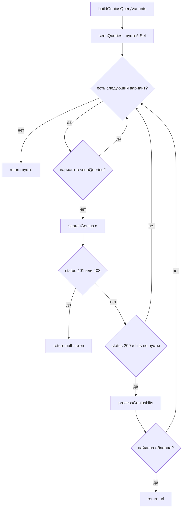

# План: обход ограничения Genius API по скобкам в поисковых запросах

## 1. Проблема

Genius API плохо работает со скобками в `q`: запрос `slipknot (sic)` ничего не
находит, а `slipknot sic` — находит. Текущая логика в
[`_fetchGenius`](../lib/sources/artwork_provider.dart:557) уже удаляет скобки
через [`ArtworkTitleUtils.cleanSearchTerm`](../lib/sources/artwork_title_utils.dart:98)
и передаёт содержимое скобок как `versionHints`, но есть пробелы:

- **Весь заголовок в скобках** — «(Sic)»: `cleanTitle` становится пустым,
  запрос превращается в «slipknot sic» (это ок), но `wantTitleNorm` = `sic`
  и [`titleMatches`](../lib/sources/artwork_title_utils.dart:190) при
  `hasVersionHints=true` отклоняет обратный contains (`apiNorm` короче
  `wantTitleNorm`), из-за чего варианты «Sic» / «(Sic)» могут не матчиться.
- **Скобки как часть названия** — «(Sic)», «(Don't Fear) The Reaper»: правило
  «всё в скобках = хинт» слишком грубо. Скобки-названия и скобки-версии
  (Remix/Edit/Live) обрабатываются одинаково, хотя для Genius это разные кейсы.
- **Нет системного fallback**: если запрос с хинтами не сработал, единственный
  retry — «без хинтов»; нет варианта «содержимое скобок как основной тайтл»
  и нет итерации по нескольким сгенерированным вариантам запроса.

## 2. Ключевая идея: классификация содержимого скобок

Вводим различение **«скобки-версия»** vs **«скобки-название»** на основе
whitelist версионных слов.

### 2.1. Whitelist версионных маркеров

```text
remix, mix, edit, version, live, acoustic, instrumental, cover, demo,
remaster, remastered, radio, extended, club, dub, vip, reprise, interlude,
intro, outro, ost, soundtrack, single, album, deluxe, mono, stereo,
slowed, reverb, sped up, nightcore, unplugged, session(s), rework, bootleg,
mashup, medley, karaoke, a cappella, orchestral, piano, symphonic,
8-bit, lofi, lo-fi, phonk, drill, ...
```

Реализация: [`ArtworkTitleUtils`](../lib/sources/artwork_title_utils.dart:8)
получает новый статический список `_versionKeywords` (lowercase). Содержимое
скобок считается **версией**, если:

- содержит хотя бы одно слово из `_versionKeywords` (word-boundary матч,
  регистронезависимо), ИЛИ
- это год (`(2001)`, `[1999 Remaster]` → часть года + keyword), ИЛИ
- уже отфильтровано как шум (`_reNoiseTag` — feat/prod/official video/...).

Всё остальное — **часть названия**: «(Sic)», «(Don't Fear) The Reaper»,
«(Reach Up for The) Sunrise», «[track 7]» не являются версиями.

### 2.2. Расширение `extractVersionHints`

Сигнатура результата расширяется третьим полем:

```dart
({
  String cleanTitle,          // как сейчас: заголовок без скобок/feat
  List<String> versionHints,  // содержимое скобок-версий (не шум)
  List<String> titleParts,    // НОВОЕ: содержимое скобок-названий
})
```

- «(Sic)» → `cleanTitle: ''`, `versionHints: []`, `titleParts: ['Sic']`
- «(Don't Fear) The Reaper» → `cleanTitle: 'The Reaper'`, `titleParts: ["Don't Fear"]`
- «Believer (Remix)» → `cleanTitle: 'Believer'`, `versionHints: ['Remix']`,
  `titleParts: []`
- «Song (feat. X) (Radio Edit)» → без изменений (`feat` = шум, `Radio Edit` = версия)

Обратная совместимость: поле `titleParts` добавляется в конец record-типа,
существующие вызовы с деструктуризацией `(:cleanTitle, :versionHints)` в
[`_fetchGenius`](../lib/sources/artwork_provider.dart:564) и
[`_fetchItunes`](../lib/sources/artwork_provider.dart:823) продолжат работать
(в Dart record-позиционные поля деструктурируются по имени — нужно проверить;
если ломается, все места использования обновляются в рамках этой задачи).

## 3. Генератор вариантов запроса

Новый чистый хелпер в [`ArtworkTitleUtils`](../lib/sources/artwork_title_utils.dart:8):

```dart
static List<String> buildGeniusQueryVariants({
  required List<String> artists,
  required String originalTitle,
  required String cleanTitle,
  required List<String> versionHints,
  required List<String> titleParts,
})
```

Возвращает **упорядоченный, дедуплицированный** список строк `q`:

| # | Вариант | Когда генерируется | Пример для «(Sic)» |
|---|---------|--------------------|--------------------|
| 1 | `artists + cleanTitle + versionHints` | всегда (текущее поведение) | `slipknot sic` |
| 2 | `artists + titleParts + cleanTitle` | `titleParts` не пуст | `slipknot sic` (дедуп с №1) |
| 3 | `artists + titleParts` (без cleanTitle) | `cleanTitle` пуст И `titleParts` не пуст | `slipknot sic` (дедуп) |
| 4 | `artists + cleanTitle` (без хинтов) | `versionHints` не пуст | — |
| 5 | `artists + originalTitle` со скобками | опционально, за флагом | `slipknot (sic)` |
| 6 | `artists + originalTitle` с `[]→()` | есть `[...]` | — |

Правила:

- **Дедупликация** через `LinkedHashSet` (порядок сохраняется, регистр/пробелы
  нормализуются при сравнении ключей).
- **Пустые варианты** (только артисты) не добавляются — этот кейс покрывает
  существующий кириллический fallback.
- Вариант №5 выключен по умолчанию (константа `_geniusTryBrackets = false`),
  чтобы не тратить запрос на заведомо проблемный кейс; включается одной строкой,
  если API в будущем починят.
- Для «(Sic)» фактическая цепочка после дедупликации: `['slipknot sic']` →
  один запрос. Для «(Don't Fear) The Reaper»: `['blue öyster cult the reaper',
  'blue öyster cult don't fear the reaper', ...]`.

## 4. Итерация по вариантам в `_fetchGenius`

Рефакторинг [`_fetchGenius`](../lib/sources/artwork_provider.dart:557):



Ключевые решения:

1. **Early-exit по успеху, а не по первому hits**: если вариант дал hits, но
   [`_processGeniusHits`](../lib/sources/artwork_provider.dart:674) не смог
   выбрать обложку (строгий матч отклонил все), переходим к следующему
   варианту. Это лучше текущего поведения «первый непустой hits побеждает».
2. **Дедупликация** — `seenQueries: Set<String>` с нормализацией
   (`toLowerCase` + схлопывание пробелов), чтобы варианты №1/№2/№3 для
   «(Sic)» не порождали три одинаковых HTTP-запроса.
3. **Сохранение кириллического fallback**: artist-only запрос остаётся
   последним шагом (после всех вариантов), с `isFallback: true`.
4. **`wantTitleNorm` и `hasVersionHints` вычисляются один раз** из исходного
   заголовка и передаются в `_processGeniusHits` для всех вариантов —
   матчинг должен быть стабилен независимо от того, какой вариант запроса
   сработал.
5. **Лимит вариантов**: не более 4 реальных HTTP-запросов (дедуплицированных)
   на трек, чтобы не раздувать задержку. Варианты сверх лимита отбрасываются.
6. Для `kDebugMode` логируется каждая попытка: `[Genius] try q=... → N hits`.

## 5. Улучшение `titleMatches`

Изменения в [`ArtworkTitleUtils.titleMatches`](../lib/sources/artwork_title_utils.dart:190):

### 5.1. Нормализация скобок на стороне API

`normalize` уже удаляет круглые/квадратные скобки как non-word символы
(через `_reNonWord`), поэтому «(Sic)» → `sic`, а «Sic» → `sic` — базовое
равенство работает. Проблема только в ветке `hasVersionHints=true`, где
обратный contains запрещён.

### 5.2. Новый параметр `cleanTitleEmpty`

```dart
static bool titleMatches(
  String apiTitle,
  String wantTitleNorm, {
  required bool hasVersionHints,
  bool cleanTitleEmpty = false,   // НОВОЕ
})
```

Логика:

```text
если wantTitleNorm пуст → true (как сейчас)
если apiNorm == wantTitleNorm → true (как сейчас)
если wantTitleNorm.length > 3 и apiNorm.contains(wantTitleNorm) → true
НОВОЕ: если cleanTitleEmpty (весь тайтл был в скобках):
    - разрешить обратный contains: apiNorm.length > 2 и
      wantTitleNorm.contains(apiNorm) → true
      (покрывает «(Sic)» vs «sic», «(Sic) [Live]» и т.п.)
    - словесный матч: множество слов wantTitleNorm ⊆ множества слов apiNorm
      → true (порядок/скобки не важны)
если !hasVersionHints: обратный contains (как сейчас)
иначе → false
```

Обоснование: когда `cleanTitle` пуст, «версия» и «название» неразличимы —
строгость, оправданная для «Believer (Remix)», здесь даёт только false
negatives. При этом **различение версий сохраняется**: для «Believer (Remix)»
`cleanTitleEmpty=false`, строгая ветка работает как раньше, страница
оригинала «Believer» по-прежнему отклоняется.

### 5.3. Откуда берётся `cleanTitleEmpty`

[`_fetchGenius`](../lib/sources/artwork_provider.dart:564) вычисляет
`cleanTitleEmpty = cleanTitle.trim().isEmpty && titleParts.isNotEmpty`
и прокидывает в `_processGeniusHits` → `titleMatches`. Аналогично для
iTunes-матчинга, если он использует `titleMatches` (проверить при
реализации; iTunes матчит мягче, через contains по подстроке).

## 6. Изменения по файлам (для реализации в Code mode)

| Файл | Изменение |
|------|-----------|
| [`lib/sources/artwork_title_utils.dart`](../lib/sources/artwork_title_utils.dart) | `_versionKeywords`; `extractVersionHints` возвращает `titleParts`; новый `buildGeniusQueryVariants`; `titleMatches` с `cleanTitleEmpty` |
| [`lib/sources/artwork_provider.dart`](../lib/sources/artwork_provider.dart) | [`_fetchGenius`](../lib/sources/artwork_provider.dart:557) — цикл по вариантам, `seenQueries`, early-exit; [`_processGeniusHits`](../lib/sources/artwork_provider.dart:674) — проброс `cleanTitleEmpty`; тест-хук `buildGeniusQueryVariantsForTest` |
| [`test/sources/artwork_provider_test.dart`](../test/sources/artwork_provider_test.dart) | новые группы тестов (см. §7) |
| `test/sources/artwork_title_utils_test.dart` (новый, опционально) | если решим вынести тесты утилит из provider-теста |

## 7. Тестовые сценарии

Все тесты — офлайн, чистые функции (как существующие в
[`artwork_provider_test.dart`](../test/sources/artwork_provider_test.dart)).

### 7.1. `extractVersionHints` / классификация скобок

1. `'(Sic)'` → `cleanTitle: ''`, `versionHints: []`, `titleParts: ['Sic']`
2. `'(Don\'t Fear) The Reaper'` → `cleanTitle: 'The Reaper'`,
   `titleParts: ["Don't Fear"]`
3. `'(Reach Up for The) Sunrise'` → `cleanTitle: 'Sunrise'`,
   `titleParts: ['Reach Up for The']`
4. `'Believer (Remix)'` → `titleParts: []` (версия, не название — регрессия
   против послабления)
5. `'Song (2001 Remaster)'` → `versionHints: ['2001 Remaster']`,
   `titleParts: []` (год + keyword = версия)
6. `'Song (Official Video)'` → всё пусто, кроме `cleanTitle: 'Song'` (шум)
7. `'Song [Live] (Acoustic)'` → обе версии в `versionHints`, `titleParts: []`
8. `'(Sic) (Remix)'` → `titleParts: ['Sic']`, `versionHints: ['Remix']`

### 7.2. `buildGeniusQueryVariants`

9. «slipknot» + «(Sic)» → варианты содержат `slipknot sic`, нет дублей,
   нет варианта с пустым тайтлом
10. «Blue Öyster Cult» + «(Don't Fear) The Reaper» → первый вариант содержит
    `the reaper`, один из вариантов содержит `don't fear the reaper`
11. «Artist» + «Song (Remix)» → есть вариант без `remix` (текущий retry №2),
    вариант с `remix` идёт первым
12. Дедупликация: входы, порождающие идентичные строки, дают список без
    повторов
13. Лимит: при >4 уникальных вариантах возвращается ровно 4, приоритет —
    первым в списке

### 7.3. `titleMatches` с `cleanTitleEmpty`

14. `titleMatches('(Sic)', 'sic', hasVersionHints: true, cleanTitleEmpty: true)` → true
15. `titleMatches('Sic', 'sic', ...)` → true (exact)
16. `titleMatches('(Sic) [Live]', 'sic', hasVersionHints: true, cleanTitleEmpty: true)` → true
17. Регрессия: `titleMatches('Believer', 'believer remix', hasVersionHints: true, cleanTitleEmpty: false)` → **false** (строгость версий сохранена)
18. Регрессия: `titleMatches('Believer (Remix) [feat. X]', 'believer remix', hasVersionHints: true)` → true (как сейчас)
19. `cleanTitleEmpty: false` не меняет поведение существующих тестов
    (прогон текущей группы `titleMatches (версионные хинты)`)

### 7.4. Интеграционный офлайн-тест `_fetchGenius` (через `geniusFetcherOverride`)

20. Мок fetcher: первый вызов с `slipknot sic` возвращает hits со страницей
    «(Sic)» → URL обложки возвращается (раньше title-матчинг мог отклонить)
21. Мок fetcher: первый вариант → 0 hits, второй вариант → hits →
    используется второй; проверяем порядок вызовов и дедупликацию
    (fetcher не вызывается дважды с одинаковым `q`)
22. 401 на первом варианте → сразу null, повторных вызовов нет (регрессия)

## 8. Риски и ограничения

- **Лишние HTTP-запросы**: до 4 на трек вместо 2–3 сейчас. Смягчается
  дедупликацией и лимитом; для «(Sic)» фактически 1 запрос.
- **Whitelist версий неполон**: экзотические версии («(DJ Ivan Scratch Remix)»)
  распознаются через keyword `remix`; чистые имена собственные в скобках
  («(For Ann)») уйдут в `titleParts` — это правильно для Genius.
- **iTunes**: та же классификация применима к
  [`_fetchItunes`](../lib/sources/artwork_provider.dart:818) (term уже
  собирается из cleanTitle+hints); расширение — отдельной задачей, здесь не
  ломаем.
- **Обратная совместимость record-типа**: добавление `titleParts` требует
  обновить все деструктуризации `extractVersionHints` (2 места в provider +
  тесты) — компилятор покажет все точки.

## 9. Порядок реализации

1. `ArtworkTitleUtils`: whitelist + `titleParts` в `extractVersionHints` + тесты §7.1
2. `ArtworkTitleUtils.buildGeniusQueryVariants` + тесты §7.2
3. `titleMatches(cleanTitleEmpty:)` + тесты §7.3
4. `_fetchGenius`: цикл вариантов, `seenQueries`, лимит, логирование
5. `_processGeniusHits`: проброс `cleanTitleEmpty`
6. Интеграционные тесты §7.4 через `geniusFetcherOverride`
7. Прогон `flutter test test/sources/` + `flutter analyze`
