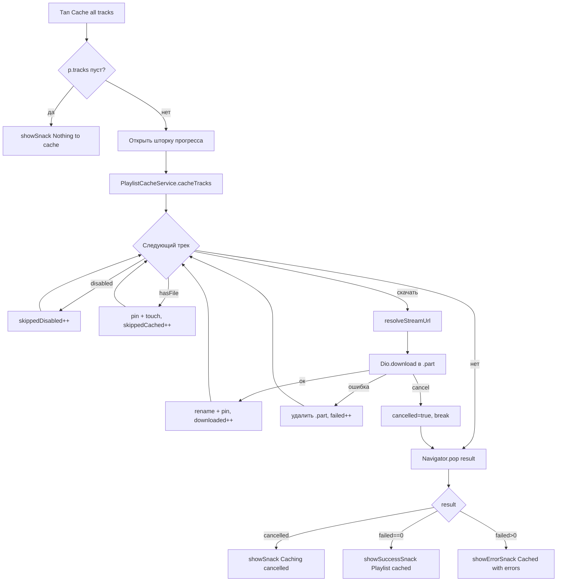

# План: «Кэшировать весь плейлист»

Функционал пакетного скачивания всех треков плейлиста в дисковый кэш
(`YoutubeCache`) с прогрессом, отменой и итоговым отчётом.

Эталон — ручное скачивание одного трека в
[`_TrackCacheTileState._download()`](lib/ui/widgets/track_settings_sheet.dart:654):
`resolveStreamUrl` → `fileFor(...).part` → `Dio().download` → rename → `pin`.

---

## 1. Архитектура: `PlaylistCacheService`

Новый файл: `lib/core/playlist_cache_service.dart`. Чистый Dart, без
Flutter-UI-зависимостей (только `foundation` для `@visibleForTesting` при
необходимости), чтобы unit-тесты не требовали виджетов.

### 1.1. Модель прогресса

```dart
/// Статус одного трека в пакетной загрузке.
enum PlaylistCacheTrackStatus { pending, downloading, done, skipped, failed }

/// Итог пакетной загрузки.
class PlaylistCacheResult {
  const PlaylistCacheResult({
    required this.downloaded,
    required this.skippedCached,
    required this.skippedDisabled,
    required this.failed,
    required this.cancelled,
  });
  final int downloaded;       // успешно скачано и закреплено
  final int skippedCached;    // уже были в кэше
  final int skippedDisabled;  // источник отключён (например, youtube)
  final int failed;           // ошибки сети/резолва
  final bool cancelled;       // пользователь отменил посередине
  int get total => downloaded + skippedCached + skippedDisabled + failed;
}

/// Снапшот прогресса для UI (эмитится через колбэк/стрим).
class PlaylistCacheProgress {
  const PlaylistCacheProgress({
    required this.completed,      // сколько треков обработано (done+skipped+failed)
    required this.total,          // треков к обработке (после фильтрации disabled)
    required this.currentTitle,   // название текущего трека ('' если нет)
    required this.currentProgress, // 0.0..1.0 по текущему треку, null если неизвестно
  });
  final int completed;
  final int total;
  final String currentTitle;
  final double? currentProgress;
}
```

### 1.2. Сигнатура сервиса

```dart
typedef PlaylistCacheDioFactory = Dio Function();

class PlaylistCacheService {
  PlaylistCacheService({
    YoutubeCache? cache,
    SourceRegistry? registry,
    PlaylistCacheDioFactory? dioFactory,
  })  : _cache = cache ?? YoutubeCache.instance,
        _registry = registry ?? SourceRegistry.instance,
        _dioFactory = dioFactory ?? _defaultDio;

  final YoutubeCache _cache;
  final SourceRegistry _registry;
  final PlaylistCacheDioFactory _dioFactory;

  /// Кэширует все доступные треки [tracks].
  ///
  /// Поведение:
  /// - треки с отключённым источником (`registry.isDisabled`) — пропуск
  ///   (учитываются в [PlaylistCacheResult.skippedDisabled]);
  /// - треки, уже лежащие в кэше (`hasFile`), — пропуск, но ДОПОЛНИТЕЛЬНО
  ///   `pin` + `touch`, чтобы повторный запуск «докреплял» эвиктнутые-by-LRU
  ///   файлы (учитываются в [PlaylistCacheResult.skippedCached]);
  /// - ошибка одного трека НЕ прерывает пакет — трек помечается failed,
  ///   .part удаляется, идём дальше;
  /// - [cancelToken] — Dio CancelToken; отмена бросает DioException с
  ///   type == cancel, которая перехватывается и превращается в
  ///   result.cancelled == true (уже скачанные остаются закреплёнными);
  /// - [onProgress] вызывается при смене трека и на каждый чанк
  ///   onReceiveProgress.
  Future<PlaylistCacheResult> cacheTracks(
    List<Track> tracks, {
    CancelToken? cancelToken,
    void Function(PlaylistCacheProgress progress)? onProgress,
  }) async { /* ... */ }

  static Dio _defaultDio() => Dio(
        BaseOptions(
          connectTimeout: const Duration(seconds: 15),
          receiveTimeout: const Duration(seconds: 30),
        ),
      );
}
```

### 1.3. Алгоритм `cacheTracks`

1. Отфильтровать треки: `disabled = tracks.where((t) => _registry.isDisabled(t.sourceId))`,
   рабочий список `queue = tracks.where((t) => !isDisabled(...))`.
2. `total = queue.length`; если `queue.isEmpty` — сразу вернуть результат
   (все disabled либо пустой плейлист).
3. Для каждого трека из `queue` последовательно (НЕ параллельно — чтобы не
   душить сеть и не плодить конкурентные записи в один каталог):
   - `cacheId = YoutubeCache.cacheIdFor(sourceId: t.sourceId, trackId: t.id)`;
   - `if (await _cache.hasFile(cacheId)) { await _cache.pin(cacheId); await _cache.touch(cacheId); skippedCached++; continue; }`
   - `final url = await _registry.require(t.sourceId).resolveStreamUrl(t);`
   - `final file = await _cache.fileFor(cacheId, extension: 'mp3');`
   - `final partPath = '${file.path}.part';`
   - `await dio.download(url, partPath, cancelToken: cancelToken, onReceiveProgress: ...)`;
   - `await File(partPath).rename(file.path);`
   - `await _cache.pin(cacheId);`
   - в `catch`: удалить `.part` (best-effort), `failed++` (или cancelled),
     продолжить.
4. После цикла вернуть `PlaylistCacheResult`.

### 1.4. Обработка отмены

Отмена — через `CancelToken`, который создаёт UI и хранит у себя. Сервис
проверяет `cancelToken?.isCancelled` между треками и ловит
`DioException(type: DioExceptionType.cancel)` внутри цикла: выставляет
`cancelled = true` и прерывает цикл (`break`), не считая отменённый трек
failed. Частичный `.part` удаляется.

### 1.5. Почему последовательно

Параллелизм (например, 3 одновременно) — возможное будущее улучшение, но в
первой версии: последовательность упрощает прогресс, отмену и не рискует
увести устройство в rate-limit источников.

---

## 2. UI

### 2.1. Пункт меню в [`_showPlaylistMenu()`](lib/ui/pages/playlist_page.dart:206)

Добавить `ListTile` ПОСЛЕ «Export playlist» и ПЕРЕД «Delete playlist»:

```dart
ListTile(
  leading: Icon(Icons.download_rounded, color: colors.textPrimary),
  title: Text('Cache all tracks', style: TextStyle(color: colors.textPrimary)),
  onTap: () async {
    HapticHelper.light(ref: ref);
    Navigator.of(sheetCtx).pop();
    await _cacheAllTracks(context, p);
  },
),
```

Иконка — `Icons.download_rounded` (в проекте шторка трека использует
download-иконку для той же операции над одним треком).

### 2.2. Метод `_cacheAllTracks` в `_PlaylistPageState`

```dart
Future<void> _cacheAllTracks(BuildContext context, Playlist p) async {
  final service = PlaylistCacheService(); // дефолтный: синглтоны
  final cancelToken = CancelToken();

  final result = await showPlaylistCacheProgressSheet(
    context,
    playlistName: p.name,
    run: (onProgress) => service.cacheTracks(
      p.tracks,
      cancelToken: cancelToken,
      onProgress: onProgress,
    ),
    onCancel: cancelToken.cancel,
  );

  if (!context.mounted || result == null) return;
  if (result.cancelled) {
    showSnack(context, 'Caching cancelled — ${result.downloaded} of ${result.total} saved');
  } else if (result.failed == 0) {
    showSuccessSnack(context, 'Playlist cached: ${result.downloaded} downloaded, '
        '${result.skippedCached} already cached'
        '${result.skippedDisabled > 0 ? ', ${result.skippedDisabled} unavailable' : ''}');
  } else {
    showErrorSnack(context, 'Cached with errors: ${result.failed} of ${result.total} failed');
  }
}
```

Снэки — через существующие хелперы [`showSnack` / `showSuccessSnack` /
`showErrorSnack`](lib/ui/widgets/snack.dart:11).

### 2.3. Шторка прогресса: `lib/ui/widgets/playlist_cache_progress_sheet.dart`

Новый файл. Публичная функция-обёртка + приватный stateful-виджет:

```dart
/// Открывает модальную шторку с прогрессом пакетного кэширования.
/// Возвращает итоговый [PlaylistCacheResult] или null, если шторку
/// закрыли системным жестом до старта/после завершения.
Future<PlaylistCacheResult?> showPlaylistCacheProgressSheet(
  BuildContext context, {
  required String playlistName,
  required Future<PlaylistCacheResult> Function(
    void Function(PlaylistCacheProgress) onProgress,
  ) run,
  required VoidCallback onCancel,
}) { ... }
```

Поведение виджета:
- `showDesktopModalSheet<PlaylistCacheResult>` (тот же хелпер, что и меню —
  консистентность мобайл/десктоп), `isDismissible: false`,
  `enableDrag: false` — нельзя случайно «смахнуть» во время загрузки.
- Состояние: `PlaylistCacheProgress _progress` + `bool _done`.
- В `initState` запускается `run((p) { if (mounted) setState(() => _progress = p); })`;
  по завершении `Navigator.pop(ctx, result)`.
- Вёрстка:
  - заголовок: `Caching “<playlistName>”`;
  - `LinearProgressIndicator(value: total == 0 ? null : completed / total)`;
  - строка счётчика: `completed / total`;
  - текущий трек: `currentTitle` (single-line, ellipsis);
  - второй тонкий индикатор текущего трека по `currentProgress`
    (indeterminate, если null — total известен не всегда);
  - кнопка `TextButton('Cancel')`: вызывает `onCancel()` (НЕ закрывает
    шторку сразу — она закроется, когда сервис дособерёт `cancelled`-результат;
    после нажатия кнопка дизейблится и меняет текст на `Cancelling…`).
- При ошибке запуска `run` шторка закрывается с `null`-подобным результатом
  `PlaylistCacheResult(... failed: total)` — упрощённо: пробрасываем
  исключение вверх через `Navigator.pop(ctx, null)` + показ error-снэка в
  вызывающем коде. Решение: `run` оборачиваем в try/catch, при фатальной
  ошибке `pop(null)` и `_cacheAllTracks` показывает
  `showErrorSnack(context, 'Caching failed: $e')`.

Тексты — английские, как в остальном проекте: `Cache all tracks`,
`Cancel`, `Cancelling…`, `Caching “…”`, снэки как в 2.2.

---

## 3. Файлы

### Новые

| Файл | Содержимое |
|---|---|
| `lib/core/playlist_cache_service.dart` | `PlaylistCacheService`, `PlaylistCacheProgress`, `PlaylistCacheResult`, `PlaylistCacheTrackStatus` (enum оставить — используется в тестах и потенциально в per-track UI), typedef `PlaylistCacheDioFactory` |
| `lib/ui/widgets/playlist_cache_progress_sheet.dart` | `showPlaylistCacheProgressSheet` + stateful виджет шторки |
| `test/core/playlist_cache_service_test.dart` | unit-тесты сервиса |
| `test/ui/playlist_cache_menu_test.dart` | widget-тест пункта меню и шторки |

### Изменяемые

| Файл | Изменение |
|---|---|
| `lib/ui/pages/playlist_page.dart` | Импорты `playlist_cache_service.dart`, `playlist_cache_progress_sheet.dart`, `snack.dart`, `package:dio/dio.dart` (только `CancelToken`); новый пункт меню в [`_showPlaylistMenu()`](lib/ui/pages/playlist_page.dart:206) между «Export playlist» и «Delete playlist»; новый метод `_cacheAllTracks` рядом с `_exportPlaylist` |

Провайдеры, БД, модели, `YoutubeCache`, `SourceRegistry` — **не меняются**.

---

## 4. Тесты

### 4.1. `test/core/playlist_cache_service_test.dart`

Фикстура по паттерну [`youtube_cache_test.dart`](test/core/youtube_cache_test.dart):

```dart
setUp(() async {
  TestHarness.ensureInitialized();
  await TestHarness.setUpDb();
  tempDir = Directory.systemTemp.createTempSync('playlist_cache_test_');
  YoutubeCache.instance.setAudioDirForTesting(tempDir);
  SourceRegistry.instance.register(_FakeSource()); // id 'muzmo'-подобный фейк
});
tearDown(() async {
  YoutubeCache.instance.setAudioDirForTesting(null);
  YoutubeCache.instance.cancelPendingEvictionForTesting();
  await tempDir.delete(recursive: true);
  await TestHarness.tearDownDb();
});
```

Замоки:
- `_FakeSource extends TrackSource` — `id`, `resolveStreamUrl` возвращает
  управляемый URL / бросает заданную ошибку; счётчик вызовов.
- Сеть: `dioFactory` возвращает `Dio` с подменённым `httpClientAdapter`
  (встроенный `HttpClientAdapter` из `package:dio`): заранее готовит байты
  `List<int>`, отдаёт `ResponseBody.fromBytes(...)`; вариант-фейк — класс
  `_FakeAdapter implements HttpClientAdapter` с очередью ответов
  (bytes / `DioException` / задержка для отмены). Это честнее, чем мокать
  сам `Dio.download`, потому что проходит настоящий путь записи файла.
- Альтернатива проще: локальный `HttpServer` на loopback (паттерн уже есть
  в `test/sources/muzmo_fixture_test.dart`-стиле) — но adapter-фейк
  детерминированнее и быстрее; выбираем adapter-фейк.

Тест-кейсы:

1. **happy path**: 3 трека, все скачиваются → файлы `*.mp3` существуют в
   tempDir, `isPinned(cacheId) == true` для каждого, результат
   `downloaded=3, failed=0`.
2. **пропуск уже закэшированных**: файл заранее создан + не закреплён →
   вызов сервиса не дёргает `resolveStreamUrl`/adapter для него
   (счётчики = 0), но файл становится pinned; `skippedCached=1`.
3. **пропуск disabled-источника**: трек с `sourceId='youtube'` (реестр
   отмечает его disabled через `_disabledForSearch` — в тесте регистрируем
   фейк и вручную помечаем через публичный API; если публичного сеттера
   нет — регистрировать фейк-реестр с подменённым `isDisabled`, для этого
   `SourceRegistry` инжектируется в конструктор) → `skippedDisabled=1`,
   сеть не дёргалась.
4. **ошибка одного трека не прерывает пакет**: 3 трека, adapter для
   второго кидает `DioException(connectionError)` → `downloaded=2, failed=1`,
   `.part`-файла второго нет в каталоге, третий скачался.
5. **ошибка резолва URL**: `resolveStreamUrl` бросает → `failed=1`, сеть
   не вызывалась для этого трека, цикл продолжился.
6. **отмена между треками**: `CancelToken.cancel()` вызывается из
   `onProgress` после первого трека → результат `cancelled=true,
   downloaded=1`, второй трек не начинался.
7. **отмена во время download**: adapter с задержкой; cancel по таймеру →
   `cancelled=true`, `.part` удалён, pin не ставился.
8. **пустой список / все disabled**: `total=0`, результат-ноль,
   `onProgress` не падает (деление на ноль отсутствует).
9. **прогресс-колбэки**: собрать список эмитов → первый и последний
   completed-счётчики корректны, `currentTitle` меняется, `currentProgress`
   в диапазоне 0..1.
10. **pin персистится**: после загрузки создать НОВЫЙ прогон `_loadPinnedIds`
    (через вызов `pin` для другого id или `hasFile`) — pinned-набор читается
    из БД TestHarness'а. Упрощённо: проверить `isPinned` + что в настройках
    БД лежит ключ `cache_pinned_ids`.

### 4.2. `test/ui/playlist_cache_menu_test.dart`

По паттерну [`settings_subpages_test.dart`](test/ui/settings_subpages_test.dart:36):
`_FakePlayer implements PlayerServiceInterface`,
`ProviderScope(overrides: [playerServiceProvider.overrideWithValue(_FakePlayer())])`,
`PackageInfo.setMockInitialValues`, `TestHarness` + `setAudioDirForTesting`.

Проблема: `_showPlaylistMenu` вызывает настоящий `PlaylistCacheService`,
который ходит в сеть. Решение — точка инжекции: `_cacheAllTracks` создаёт
сервис через `@visibleForTesting static PlaylistCacheService Function()?
playlistCacheServiceFactoryOverride` в `PlaylistPage`, который тест
подменяет на фейк (`cacheTracks` возвращает управляемый результат /
Completer для проверки отмены). Альтернатива без оверрайда — топнуть тест
только до открытия шторки и проверить её наличие, а сеть не дёргать
(но тогда не тестируется итоговый снэк). Выбираем factory-override —
минимальная цена, полная наблюдаемость.

Тест-кейсы:

1. **пункт меню виден и нажимается**: pump `PlaylistPage(playlistId: ...)`
   с плейлистом из репозитория (заполнить через `playlistRepositoryProvider`
   / `PlaylistDao` в setUp) → тап по кнопке меню (more_vert) →
   `expect(find.text('Cache all tracks'), findsOneWidget)` → тап → меню
   закрылось, шторка прогресса открылась
   (`find.textContaining('Caching')`).
2. **кнопка Cancel вызывает отмену**: фейк-сервис ждёт Completer; тап по
   `Cancel` → у фейка `cancelToken.isCancelled == true` (или вызван
   `onCancel`), текст кнопки стал `Cancelling…`, кнопка задизейблена.
3. **итоговый success-снэк**: фейк сразу возвращает `downloaded=2,
   skippedCached=1, failed=0` → `pumpAndSettle` →
   `find.textContaining('Playlist cached')` найден.
4. **итоговый error-снэк**: `failed=1` → `find.textContaining('Cached with errors')`.
5. **cancelled-снэк**: `cancelled=true` → `find.textContaining('Caching cancelled')`.
6. **unmounted-страница**: пока фейк-сервис висит, `Navigator.pop` страницы
   → завершение фейка не крашит тест (guard `context.mounted`).

Плейлист для теста: создать через `ref.read(playlistRepositoryProvider)` или
напрямую DAO — смотреть как это делают существующие widget-тесты
(`test/ui/widget_test.dart`, `test/ui/desktop_queue_panel_test.dart`) и
следовать их способу.

---

## 5. Риски и краевые случаи

| Случай | Решение в плане |
|---|---|
| Пустой плейлист | `queue.isEmpty` → мгновенный `PlaylistCacheResult(total=0)`; UI показывает success-снэк `Playlist cached: 0 downloaded…` — допустимо, либо до открытия шторки проверить `p.tracks.isEmpty` и показать `showSnack(context, 'Nothing to cache')` без шторки (выбрать этот вариант) |
| Все треки уже в кэше | Прогон быстрый: только pin+touch на каждый. Шторка мигнёт — приемлемо; результат `skippedCached=N`, снэк сообщает об этом явно |
| Треки с disabled-источником (youtube) | Фильтр до `total`, чтобы прогресс-бар не «зависал» на недостижимых треках; счётчик `skippedDisabled` попадает в снэк |
| Ошибка сети на одном треке | `failed++`, `.part` удалён, цикл продолжается; итог — error-снэк с числом |
| Отмена посередине | `CancelToken`: чистый break, частичные результаты сохранены (скачанные остаются pinned), снэк `Caching cancelled — X of Y saved` |
| LRU-эвикт во время загрузки | Эвиктор не трогает `.part` (активные загрузки) и pinned; pin ставится сразу после rename — окно уязвимости между rename и pin минимально. `fileFor` планирует эвикт с дебаунсом 30 c, так что реальный прогон во время пакета маловероятен; если и случится — .part защищён |
| Лимит кэша меньше плейлиста | Скачанные+pinned не эвиктятся → кэш может превысить лимит. Это уже поведение ручной загрузки одного трека, сохраняем консистентность; отдельной обработки не требуется (при желании — будущий enhancement: предупреждение о размере) |
| Unmounted widget | Все обращения к `context`/setState после await — под `mounted`/`context.mounted`; сервис вообще не знает о виджетах |
| Повторный тап по пункту меню во время загрузки | Шторка модальна (`isDismissible: false`), страница под ней недоступна — повторный запуск невозможен |
| Источник не зарегистрирован (require кидает StateError) | Ловится общим catch трека → `failed++` |
| Плейлист изменился во время загрузки | Сервис работает со снапшотом `List<Track>`, переданным на старте; гонок с БД нет |
| `total` в onReceiveProgress <= 0 (нет Content-Length) | `currentProgress = null` → indeterminate индикатор для текущего трека; общий прогресс `completed/total` продолжает работать |

---

## 6. Порядок выполнения (чеклист для Code-режима)

- [ ] 1. Создать `lib/core/playlist_cache_service.dart`: модели `PlaylistCacheProgress`, `PlaylistCacheResult`, enum `PlaylistCacheTrackStatus`, класс `PlaylistCacheService` с инжектируемыми `YoutubeCache`, `SourceRegistry`, `dioFactory`; реализовать `cacheTracks` по алгоритму 1.3 (последовательно, с CancelToken, pin/touch для уже закэшированных, удалением `.part` при ошибке).
- [ ] 2. Написать `test/core/playlist_cache_service_test.dart`: харнесс `TestHarness` + `setAudioDirForTesting`, `_FakeSource`, `_FakeAdapter` (HttpClientAdapter), кейсы 1–10 из §4.1. Прогнать `flutter test test/core/playlist_cache_service_test.dart`.
- [ ] 3. Создать `lib/ui/widgets/playlist_cache_progress_sheet.dart`: `showPlaylistCacheProgressSheet` + stateful виджет (два индикатора, счётчик, текущий трек, Cancel → Cancelling…).
- [ ] 4. Изменить `lib/ui/pages/playlist_page.dart`: импорты; пункт меню `Cache all tracks` (Icons.download_rounded) между «Export playlist» и «Delete playlist»; метод `_cacheAllTracks` со снэками через `showSnack`/`showSuccessSnack`/`showErrorSnack`; ранний выход `Nothing to cache` при пустом списке; `@visibleForTesting` factory-override для сервиса.
- [ ] 5. Написать `test/ui/playlist_cache_menu_test.dart`: `_FakePlayer`, `ProviderScope`, factory-override с фейковым сервисом, кейсы 1–6 из §4.2.
- [ ] 6. Прогнать `flutter analyze` (проектный линт: `analysis_options.yaml`) и исправить замечания.
- [ ] 7. Прогнать весь набор: `flutter test` — убедиться, что старые тесты не сломаны (в частности `test/core/youtube_cache_test.dart`, `test/ui/widget_test.dart`).
- [ ] 8. Ручная проверка на Windows (`tools/run_windows.ps1`): открыть плейлист → меню → Cache all tracks → проверить прогресс, отмену, снэки; проверить, что треки играются офлайн из кэша (LockCachingAudioSource берёт pinned-файлы).

---

## 7. Диаграмма потока


