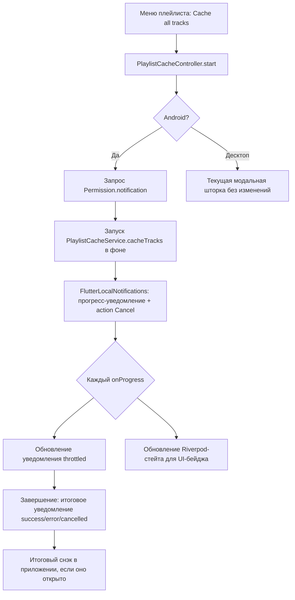

# План: Перенос прогресса кэширования плейлиста в системные уведомления Android

## Контекст и цель

Сейчас пакетное кэширование плейлиста («Cache all tracks» на странице плейлиста)
открывает **модальную шторку** [`showPlaylistCacheProgressSheet()`](../lib/ui/widgets/playlist_cache_progress_sheet.dart:26),
которая:

- блокирует весь экран на всё время загрузки (нельзя листать плейлист, искать и т.д.);
- живёт внутри [`_cacheAllTracks()`](../lib/ui/pages/playlist_page.dart:365) — привязана к странице;
- умирает вместе со страницей/приложением при сворачивании.

**Цель:** прогресс кэширования переносится в **системное уведомление Android**
(шторка ОС) с прогресс-баром и кнопкой отмены; кэширование продолжает работать
в фоне даже при свёрнутом приложении. На главном экране приложения модальной
шторки больше не должно быть. Десктоп (Windows) — не трогаем: там остаётся
текущее поведение (шторка, ограниченная 520px, через `isDesktop`).

## Текущее состояние (факты из кода)

| Что | Где | Роль |
|---|---|---|
| `PlaylistCacheService.cacheTracks()` | [`lib/core/playlist_cache_service.dart:115`](../lib/core/playlist_cache_service.dart:115) | Чистый Dart, без UI: скачивает очередь, эмитит `PlaylistCacheProgress`, поддерживает `CancelToken` |
| Модальная шторка прогресса | [`lib/ui/widgets/playlist_cache_progress_sheet.dart`](../lib/ui/widgets/playlist_cache_progress_sheet.dart) | Показывает прогресс + Cancel; `run` запускается при создании стейта; результат возвращается через `Navigator.pop` |
| Вызов из меню плейлиста | [`_cacheAllTracks()`](../lib/ui/pages/playlist_page.dart:365) | Создаёт `PlaylistCacheService`, `CancelToken`, `await showPlaylistCacheProgressSheet(...)`, затем итоговый снэк |
| Фабрика сервиса для тестов | `PlaylistPage.playlistCacheServiceFactoryOverride` | Подмена в [`test/ui/playlist_cache_menu_test.dart`](../test/ui/playlist_cache_menu_test.dart) |
| Разрешения в манифесте | [`android/app/src/main/AndroidManifest.xml`](../android/app/src/main/AndroidManifest.xml) | Уже есть: `POST_NOTIFICATIONS`, `FOREGROUND_SERVICE`, `FOREGROUND_SERVICE_MEDIA_PLAYBACK`, `WAKE_LOCK`, `INTERNET` |
| permission_handler | [`pubspec.yaml:61`](../pubspec.yaml:61) | Уже в зависимостях — используем для запроса `Permission.notification` на Android 13+ |
| DI | Riverpod, [`lib/core/providers.dart`](../lib/core/providers.dart) | Провайдеры приложений; сюда добавим новые |

**Отсутствует:** плагин для локальных уведомлений с прогрессом. Нужен
`flutter_local_notifications` (поддержка `AndroidNotificationDetails.progress`,
action-кнопок, foreground service типа `dataSync`/`mediaPlayback`).

## Архитектура решения

### Новые компоненты

1. **`lib/core/notifications/playlist_cache_notifier.dart`** — обёртка над
   `flutter_local_notifications`:
   - `init()` — инициализация канала `playlist_cache` (low importance, без звука);
   - `showProgress(PlaylistCacheProgress, playlistName)` — обновляемое
     уведомление (тот же id, `setProgress`, `ongoing: true`,
     `onlyAlertOnce: true`); throttle ~500 мс;
   - `showResult(PlaylistCacheResult, playlistName)` — финальное уведомление;
   - `attachCancelAction(VoidCallback)` — обработка action `cancel_cache`.
   - Чистый интерфейс + реализация только для Android; на остальных
     платформах — no-op (защита от MissingPluginException).

2. **`lib/core/playlist_cache_controller.dart`** — синглтон/провайдер,
   отвязанный от UI:
   - `start(playlistName, tracks, {sourceFactory})` — создаёт
     `PlaylistCacheService` + `CancelToken`, запускает `cacheTracks` **без
     ожидания в UI**, подписывает `onProgress` на notifier;
   - держит `StateNotifierProvider<PlaylistCacheState>` (idle / running /
     finished) — чтобы UI (значок в заголовке плейлиста) мог показывать статус
     без модального окна;
   - `cancel()` — дёргает `CancelToken`, вызывается и из уведомления, и из UI;
   - предотвращает параллельные запуски (один активный батч за раз, как сейчас).

3. **Правки в [`playlist_page.dart`](../lib/ui/pages/playlist_page.dart:365)**:
   - `_cacheAllTracks` на Android больше не вызывает
     `showPlaylistCacheProgressSheet`, а вызывает `controller.start(...)`;
   - итоговые снэки сохраняются (показываются, когда приложение на экране —
     слушаем завершение через провайдер);
   - на десктопе — прежняя шторка (ветвление уже есть через `isDesktop`).

### Пробуждение приложения для action-кнопки

`flutter_local_notifications` доставляет action-кнопки через payload-callback
при **запущенном** Flutter-engine. Так как фоновая загрузка выполняется в
Dart-isolate основного приложения, приложение остаётся живым (foreground
service не даст ОС убить процесс во время загрузки) — этого достаточно для
кнопки Cancel без нативного Kotlin-кода. Если процесс всё же убит —
уведомление с прогрессом исчезает, частично скачанное осталось в `.part`
(сервис уже корректно чистит при следующем запуске).

### Foreground service для надёжности фона

Чтобы ОС не убила загрузку при сворачивании приложения:

- вариант A (рекомендуемый): `flutter_local_notifications` с
  `AndroidNotificationDetails(..., foregroundServiceTypes:
  {AndroidForegroundServiceType.dataSync})` + запуск Android foreground
  service из Dart (`show()` с `ongoing` уведомлением достаточно, чтобы
  процесс держался). В манифест добавить
  `<uses-permission android:name="android.permission.FOREGROUND_SERVICE_DATA_SYNC"/>`
  и сервис-декларацию плагина;
- вариант B (запасной): WAKE_LOCK-акquisition через existing permission —
  менее надёжен, но без изменений манифеста.

Рекомендуется вариант A: манифест уже содержит паттерн foreground-сервисов
(аудио), добавление dataSync — одна строка.

### Уведомление (внешний вид)

- **Во время загрузки:** `Caching "Имя плейлиста"` · `5 / 32` ·
  `Название трека` · прогресс-бар (determinate), action «Cancel», `ongoing`,
  `silence`, не пропадает свайпом.
- **Итог success:** `Playlist cached` · `30 downloaded, 2 already cached`,
  исчезает по таймауту, пропадает свайпом.
- **Итог error/cancelled:** аналогично с соответствующим текстом (тексты
  переиспользуем из [`_cacheAllTracks`](../lib/ui/pages/playlist_page.dart:391)).

## Пошаговый план работ

### Этап 1 — Зависимости и платформенная обвязка
- [ ] 1.1. Добавить `flutter_local_notifications` в [`pubspec.yaml`](../pubspec.yaml) (актуальная ^18.x).
- [ ] 1.2. [`AndroidManifest.xml`](../android/app/src/main/AndroidManifest.xml):
  добавить `FOREGROUND_SERVICE_DATA_SYNC` permission, receiver/action для
  уведомлений плагина (по документации плагина), при необходимости —
  `SCHEDULE_EXACT_ALARM` не нужен (не используем отложенные).
- [ ] 1.3. Инициализация плагина в [`lib/main.dart`](../lib/main.dart) при
  старте (только `Platform.isAndroid`), запрос
  `Permission.notification.request()` перед первым запуском кэширования
  (Android 13+), graceful fallback: если отказано — кэширование всё равно
  идёт, но без уведомления (и снэк-подсказка «Notifications disabled»).

### Этап 2 — Notifier-обёртка
- [ ] 2.1. Создать `lib/core/notifications/playlist_cache_notifier.dart`
  с интерфейсом `PlaylistCacheNotifier` + `AndroidPlaylistCacheNotifier`
  (реализация) + `NoopPlaylistCacheNotifier` (все остальные платформы).
- [ ] 2.2. Реализовать прогресс-уведомление: id константа, `setProgress`,
  `onlyAlertOnce`, throttle обновлений (каждые ~500 мс или смене трека —
  `onProgress` стреляет на каждый чанк, это сотни вызовов на трек).
- [ ] 2.3. Реализовать action «Cancel»: `AndroidNotificationAction` с
  payload, обработчик через `onDidReceiveNotificationResponse` →
  `controller.cancel()`.
- [ ] 2.4. Юнит-тесты: throttle-логика, маппинг `PlaylistCacheProgress` →
  строки уведомления (чистые функции, плагин мокается интерфейсом).

### Этап 3 — Контроллер фонового кэширования
- [ ] 3.1. Создать `lib/core/playlist_cache_controller.dart`:
  `StateNotifierProvider` со стейтом `PlaylistCacheRunState`
  (`idle | running(PlaylistCacheProgress) | finished(PlaylistCacheResult)`),
  метод `start()`, `cancel()`, запрет параллельных запусков.
- [ ] 3.2. Подключить notifier: `onProgress` → обновление стейта +
  уведомление; завершение → итоговое уведомление + стейт `finished`.
- [ ] 3.3. Итоговые снэки: `playlist_page.dart` слушает переход
  `running → finished` (ref.listen) и показывает существующие снэки — только
  когда приложение в foreground (иначе только системное уведомление).
- [ ] 3.4. Юнит-тесты контроллера: start/cancel/повторный start/ошибка
  запуска (сервис-фейк, паттерн [`test/core/playlist_cache_service_test.dart`](../test/core/playlist_cache_service_test.dart)).

### Этап 4 — Перенос UI: убрать шторку с главного экрана
- [ ] 4.1. [`_cacheAllTracks()`](../lib/ui/pages/playlist_page.dart:365):
  на Android — `controller.start(...)`, шторка не открывается; на десктопе —
  без изменений.
- [ ] 4.2. Опционально (рекомендуется): индикатор в UI — компактный
  LinearProgressIndicator / бейдж «Caching… 5/32» в заголовке
  PlaylistPage (из провайдера стейта), кнопка Cancel рядом; это сохраняет
  видимость процесса в приложении без блокировки экрана.
- [ ] 4.3. Обновить виджет-тесты [`test/ui/playlist_cache_menu_test.dart`](../test/ui/playlist_cache_menu_test.dart):
  - тесты шторки на Android-ветке заменяются на проверку провайдера
    (running → finished) и отсутствие модального барьера;
  - desktop-ветка (или прямой вызов шторки) остаётся как регрессия.

### Этап 5 — Десктоп и фиксация поведения
- [ ] 5.1. Убедиться, что на Windows/десктопе ничего не меняется:
  `isDesktop`-ветка в [`playlist_cache_progress_sheet.dart:47`](../lib/ui/widgets/playlist_cache_progress_sheet.dart:47)
  и в `_cacheAllTracks` остаётся; `NoopPlaylistCacheNotifier` не делает
  ничего на десктопе.
- [ ] 5.2. Прогон `flutter analyze` и всего тестового набора
  (`dart test` / `flutter test`).

### Этап 6 — Проверка на устройстве
- [ ] 6.1. Реальная проверка на Android: запуск кэширования, сворачивание
  приложения — прогресс идёт, уведомление обновляется; Cancel из уведомления
  останавливает; итоговое уведомление корректно; повторный запуск работает.
- [ ] 6.2. Проверка кейса «уведомления отключены» — загрузка идёт без
  уведомления, снэк-подсказка показана.

## Риски и компромиссы

| Риск | Митигация |
|---|---|
| ОС убивает процесс при длительной свёрнутой загрузке | Foreground service через `dataSync` + `ongoing` уведомление (этап 1.2/2.2); текущий `WAKE_LOCK` уже есть |
| Action «Cancel» не приходит, если процесс убит | Кэширование выполняется в основном isolate — процесс жив, пока работает foreground service; fallback — `.part`-файлы чистятся при следующем запуске |
| `onProgress` стреляет очень часто (каждый чанк) | Throttle 500 мс в notifier + обновление Riverpod-стейта только на смене трека/каждый N |
| Сломаются существующие тесты шторки | Этап 4.3 переписывает только Android-ветку; desktop-тесты шторки сохраняются |
| Android 13+ runtime-разрешение на уведомления | Запрос через существующий `permission_handler` перед первым стартом; graceful fallback без уведомлений |
| `flutter_local_notifications` тянет много платформенного кодла | Инициализация только на Android; no-op обёртка на остальных платформах |

## Файлы: сводка изменений

| Файл | Тип | Что делаем |
|---|---|---|
| `pubspec.yaml` | правка | + `flutter_local_notifications` |
| `android/app/src/main/AndroidManifest.xml` | правка | + `FOREGROUND_SERVICE_DATA_SYNC`, receiver плагина |
| `lib/core/notifications/playlist_cache_notifier.dart` | новый | Прогресс-уведомления Android + no-op реализация |
| `lib/core/playlist_cache_controller.dart` | новый | Фоновый запуск, стейт для UI, отмена |
| `lib/core/providers.dart` | правка | Провайдеры notifier + controller |
| `lib/main.dart` | правка | Инициализация нотификаций на Android |
| `lib/ui/pages/playlist_page.dart` | правка | `_cacheAllTracks` → контроллер на Android; снэки через ref.listen |
| `lib/ui/widgets/playlist_cache_progress_sheet.dart` | без изменений | Остаётся для десктопа |
| `test/core/playlist_cache_controller_test.dart` | новый | Тесты контроллера |
| `test/core/notifications/playlist_cache_notifier_test.dart` | новый | Тесты throttle/маппинга |
| `test/ui/playlist_cache_menu_test.dart` | правка | Android-ветка → провайдер, desktop-регрессия |
