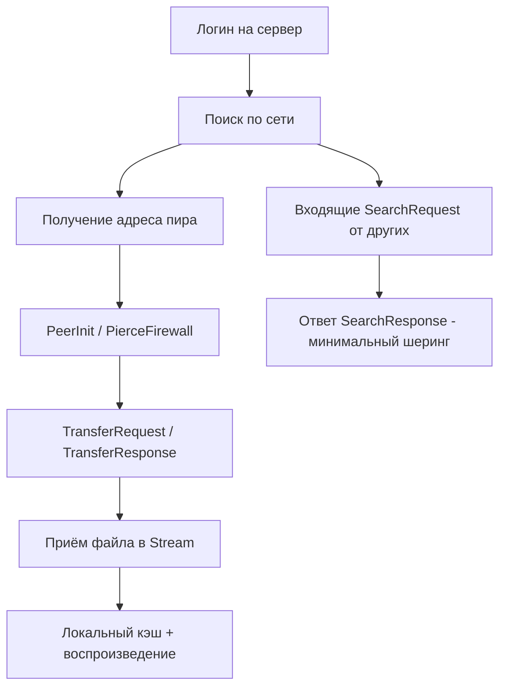
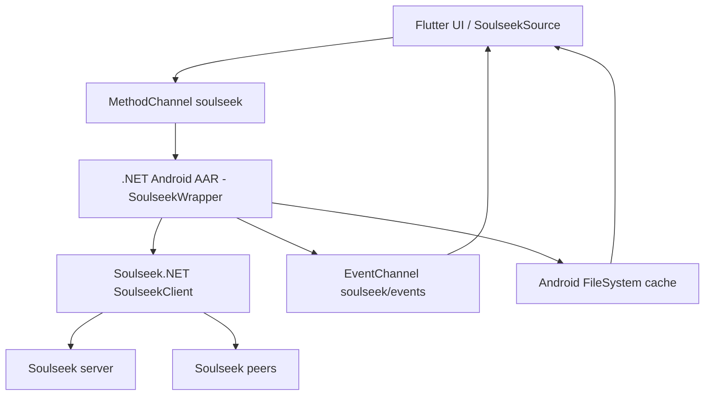
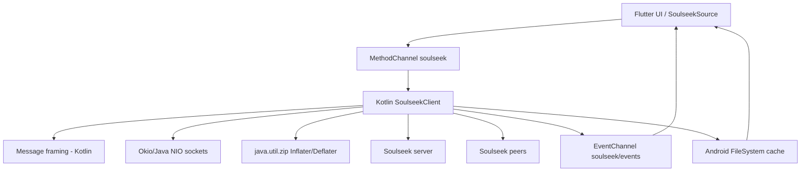
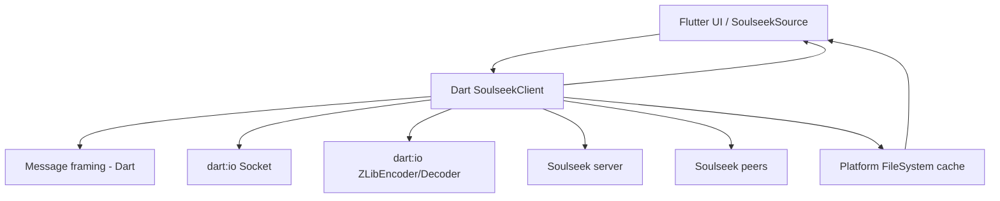
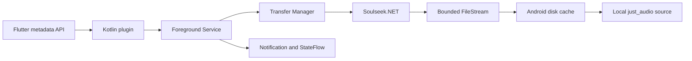
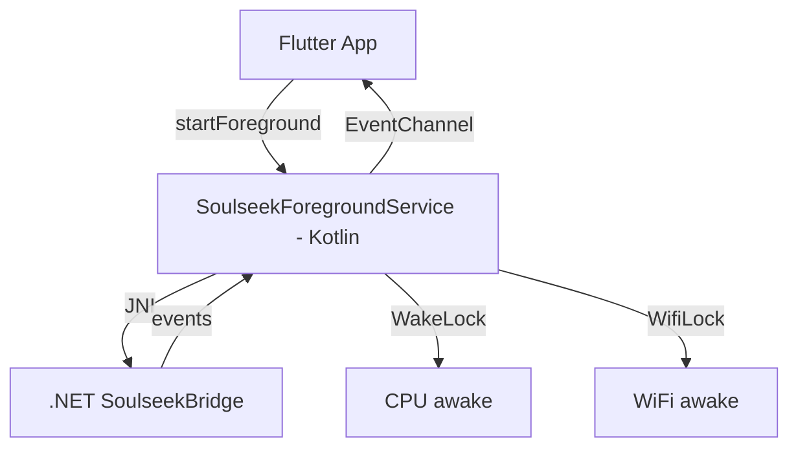

# План внедрения источника Soulseek (Android-first, GPL-3.0)

## 1. Контекст и ограничения

### Что изменилось с первой версии плана

| Параметр | Было | Стало |
|----------|------|-------|
| Целевая платформа | Desktop MVP → потом Android | **Android-first** |
| Лицензия проекта | Не определена | **GPL-3.0 разрешён** (open source) |
| Использование кода Soulseek.NET | Запрещено копировать | **Можно использовать напрямую** |
| Архитектура | Внешний HTTP-bridge процесс | Нативная интеграция в APK |

### Ключевые факты

- Soulseek — P2P-сеть. Результат поиска — это удалённый файл конкретного пользователя, не постоянный URL.
- **Обязательный шеринг**: Soulseek требует делиться файлами для скачивания. Чистый потребитель невозможен.
- SeekerAndroid — C#/.NET MAUI проект (GPL-3.0-only + Additional Terms), использует модифицированную Soulseek.NET.
- Soulseek.NET — полная C# реализация протокола, ~130 классов, ~15 000 строк, **минимальные зависимости** (только `Microsoft.CSharp`, `System.Memory` — нет внешних runtime-зависимостей).
- Текущий Flutter-проект имеет чистую plugin-архитектуру: [`TrackSource`](../lib/sources/track_source.dart:10) → [`SourceRegistry`](../lib/sources/source_registry.dart:11) → плеер через `just_audio`.

---

## 2. Анализ кодовой базы Soulseek.NET

### Структура и объём

| Слой | Файлов | Строк (прибл.) | Назначение |
|------|--------|----------------|------------|
| `SoulseekClient.cs` | 1 | 4 984 | Оркестрация: логин, поиск, загрузка, загрузка вверх, browse |
| `ISoulseekClient.cs` | 1 | 1 498 | Интерфейс клиента |
| `Network/` | 12 | ~4 000 | TCP-соединения, listener, NAT traversal, peer/distributed connection managers |
| `Messaging/` | ~70 | ~5 000 | Message builder/reader, 60+ классов сообщений (Server/Peer/Distributed/Init) |
| `Messaging/Compression/` | 13 | ~3 500 | Полная реализация zlib 1.1.3 (порт с Java на C#) |
| `Common/` | 7 | ~1 000 | Waiter, TokenFactory, TokenBucket, IOAdapter, Extensions, Constants |
| `Options/` | 7 | ~800 | SoulseekClientOptions, ConnectionOptions, TransferOptions, SearchOptions |
| `EventArgs/` | 25 | ~600 | События клиента |
| `Exceptions/` | 20 | ~500 | Иерархия исключений |
| Прочие модели | ~15 | ~800 | File, Directory, Search, Transfer, RoomData, UserInfo и т.д. |
| **Итого src/** | **~130** | **~15 000** | |

### Что нужно для MVP search + download + minimal share

Для минимума нужны: логин, поиск, разрешение адреса пира, подключение к пиру, запрос трансфера, приём файла, ответ на входящие поисковые запросы (минимальный шеринг).



### Минимальный набор классов для MVP

| Компонент | Классы Soulseek.NET | Обязательный? |
|-----------|---------------------|---------------|
| Фрейминг сообщений | `MessageBuilder`, `MessageReader`, `MessageCode` | Да |
| Серверные сообщения | `LoginRequest`, `LoginResponse`, `SearchRequest`, `ServerSearchRequest`, `UserAddressRequest`, `UserAddressResponse`, `ConnectToPeerRequest`, `ConnectToPeerResponse`, `SetListenPortCommand`, `SetSharedCountsCommand`, `ServerPing`, `HaveNoParentsCommand`, `BranchLevelCommand`, `BranchRootCommand`, `NetInfoNotification` | Да (~15) |
| Peer-сообщения | `PeerInit`, `PierceFirewall`, `TransferRequest`, `TransferResponse`, `QueueDownloadRequest`, `PeerSearchRequest`, `SearchResponseFactory`, `UploadDenied`, `UploadFailed`, `PlaceInQueueRequest`, `PlaceInQueueResponse` | Да (~11) |
| Distributed | `DistributedSearchRequest`, `DistributedBranchLevel`, `DistributedBranchRoot`, `DistributedChildDepth`, `DistributedPingRequest`, `DistributedPingResponse` | Желательно (6) |
| Сжатие | `ZOutputStream`, `ZInputStream`, `ZStream`, `Deflate`, `Inflate`, `InfBlocks`, `InfCodes`, `InfTree`, `StaticTree`, `Tree`, `Adler32`, `Zlib`, `SupportClass` | Да, но заменяемо |
| Сеть | `Connection`, `MessageConnection`, `Listener`, `TcpClientAdapter`, `TcpListenerAdapter`, `NetworkStreamAdapter`, `PeerConnectionManager`, `DistributedConnectionManager`, `ConnectionFactory`, `ListenerHandler` | Да |
| Оркестрация | `SoulseekClient` (или переписанный аналог) | Да |
| Координация | `Waiter`, `TokenFactory`, `TokenBucket` | Да |
| Модели | `File`, `FileAttribute`, `SearchResponse`, `SearchQuery`, `SearchScope`, `Transfer` | Да |

**Итого для MVP**: ~65 классов из ~130. Чат, комнаты, привилегии, wishlist, browse — можно пропустить.

### Зависимости

```xml
<!-- Soulseek.csproj -->
<PackageReference Include="Microsoft.CSharp" Version="4.7.0" />
<PackageReference Include="System.Memory" Version="4.6.0" />
<!-- Только анализаторы, без runtime-зависимостей -->
```

Сжатие — встроенная реализация zlib (порт с Java). На платформах с нативным zlib её можно заменить.

---

## 3. Оценка сложности трёх вариантов интеграции

### Вариант A: .NET Android Library → AAR → Flutter Platform Channel

**Суть**: собрать Soulseek.NET в .NET Android class library, скомпилировать в AAR, включить в Flutter Android-сборку, вызывать через MethodChannel/EventChannel.

**Доказанная осуществимость**: SeekerAndroid уже использует SoulseekClient напрямую в .NET MAUI Android-приложении (`SeekerState.SoulseekClient = new SoulseekClient(...)`, вызовы `SearchAsync`, `DownloadAsync`, `BrowseAsync`). .NET для Android компилирует C# в native Android код.

**Архитектура**:



| Критерий | Оценка |
|----------|--------|
| **Объём нового кода** | Низкий. Wraper ~500-800 строк C# + ~300 строк Dart (MethodChannel/EventChannel). Soulseek.NET — как есть. |
| **Протокольный риск** | Минимальный. Код проверен SeekerAndroid + оригинальным Soulseek.NET. |
| **Сборка** | Высокая сложность. Два toolchain: .NET SDK для AAR + Flutter/Gradle. Нужно настроить .NET Android AOT/trimmer. |
| **Размер APK** | +10-15 MB (.NET runtime для Android). |
| **Производительность** | Нативная. C# → AOT → native код. TcpClient/NetworkStream работают на Android (SeekerAndroid доказал). |
| **Background работа** | Foreground Service на Kotlin/Java, .NET-код вызается через JNI. WakeLock/WifiLock — на стороне Kotlin. |
| **zlib** | Используется встроенная реализация Soulseek.NET. Возможны trim warnings — нужно проверить. |
| **Поддержка** | Зависит от .NET Android releases. Обновление Soulseek.NET — просто subtree pull. |
| **iOS** | .NET iOS теоретически возможен, но не проверен в этом контексте. Отдельная сборка. |
| **Лицензия** | GPL-3.0. AAR с GPL-кодом в одном APK → весь APK должен быть GPL. Подходит. |

**Риски**:
- .NET trimmer может вырезать reflection-зависимые части zlib-порта
- Отладка: C# в AAR + Dart во Flutter — два отладчика
- Обновление .NET SDK / Android API level может ломать сборку
- Мост через JNI: сериализация сложных объектов (SearchResponse с File-списками) через MethodChannel требует ручного маппинга в Map<String, dynamic>

**Вердикт**: Наименьший протокольный риск, но наибольшая сложность сборки и поддержки toolchain.

---

### Вариант B: Kotlin-порт протокола Soulseek (по Soulseek.NET как референсу)

**Суть**: перенести минимальный набор протокольных классов Soulseek.NET в Kotlin, использовать как нативную Android-библиотеку внутри Flutter-проекта.

**Архитектура**:



| Критерий | Оценка |
|----------|--------|
| **Объём нового кода** | Высокий. ~3 000-5 000 строк Kotlin для MVP (порт ~65 классов). |
| **Протокольный риск** | Средний. Порт может содержать баги бинарного фрейминга, NAT traversal, edge cases. Но Soulseek.NET — хороший референс. |
| **Сборка** | Простая. Один toolchain: Flutter + Gradle + Kotlin. |
| **Размер APK** | +0 (Kotlin runtime уже в Flutter Android). |
| **Производительность** | Нативная. Корутины вместо async/await. Java NIO вместо TcpClient. |
| **Background работа** | Нативный Foreground Service на Kotlin. WakeLock/WifiLock — естественно. |
| **zlib** | `java.util.zip.Inflater` / `Deflater` — нативная JVM-реализация. Проверить совместимость формата с Soulseek. |
| **Поддержка** | Полный контроль. Но ручное обновление при изменениях протокола Soulseek. |
| **iOS** | Нужен отдельный порт на Swift, либо Dart-реализация. |
| **Лицензия** | GPL-3.0 (производное произведение от Soulseek.NET). Подходит. |

**Что портировать**:
1. `MessageBuilder` / `MessageReader` — бинарный фрейминг (~400 строк)
2. `MessageCode` — константы кодов сообщений (~200 строк)
3. ~25 классов сообщений (Server + Peer + Init) — сериализация/десериализация (~1 500 строк)
4. Connection layer — TCP connect, listener, NAT traversal (~800 строк)
5. `SoulseekClient` orchestration — логин, поиск, download (~1 000 строк)
6. `Waiter` / `TokenFactory` — асинхронная координация (~300 строк)
7. Models: `File`, `SearchResponse`, `Transfer` (~300 строк)
8. Wrapper для Flutter Platform Channel (~400 строк)

**Риски**:
- Баги бинарного протокола: little-endian / big-endian, length-prefixed strings, массивы
- NAT traversal (pierce-firewall, ConnectToPeer) — сложная логика с таймингами
- Encoding: SeekerAndroid добавил Latin-1 fallback для мохибакэ — нужно учесть
- Время на порт и отладку P2P-протокола

**Вердикт**: Наибольший объём ручной работы, но наилучшая интеграция с Flutter/Android и нулевой overhead.

---

### Вариант C: Dart-реализация с нуля (по Messaging/ как спецификации)

**Суть**: реализовать протокол Soulseek на чистом Dart, используя Soulseek.NET Messaging/ как спецификацию.

**Архитектура**:



| Критерий | Оценка |
|----------|--------|
| **Объём нового кода** | Высокий. ~3 000-5 000 строк Dart (аналогично Kotlin). |
| **Протокольный риск** | Высокий. Нет референс-реализации на Dart. Отладка P2P в Dart сложнее. |
| **Сборка** | Самая простая. Один toolchain: Flutter + Dart. |
| **Размер APK** | +0. |
| **Производительность** | Хорошая, но `dart:io Socket` на мобильных имеет edge cases (background execution, Doze mode). |
| **Background работа** | Проблемная. Dart isolate во background на Android убивается системой. Нужен workaround через Foreground Service + platform channel для keep-alive. |
| **zlib** | `dart:io` имеет `ZLibCodec` / `GZipCodec`. Нужно проверить совместимость с Soulseek zlib-форматом (zaghead + adler32). |
| **Поддержка** | Полный контроль. Единая кодовая база для всех платформ. |
| **iOS** | Работает из коробки (если background-задачи решены). |
| **Лицензия** | GPL-3.0 (производное произведение). Подходит. |

**Ключевая проблема — background execution на Android**:

Dart-код во Flutter работает в одном isolate. Когда приложение уходит в background:
- Android может убить Dart isolate (особенно при Doze/App Standby)
- Длительные загрузки Soulseek требуют foreground service
- Решение: Kotlin Foreground Service, который держит wakeup-lock и периодически пингует Dart-сторону — но тогда часть логики всё равно на Kotlin

**Риски**:
- Максимальный протокольный риск: нет существующей Dart-реализации для сравнения
- Background execution: Dart не может сам держать foreground service
- Сжатие: формат zlib в Soulseek может не совпадать с `dart:io` codec
- NAT traversal на `dart:io Socket`: нужно проверить ServerSocket + pierce-firewall

**Вердикт**: Самая чистая архитектура, но наибольший риск и проблема с background execution на Android.

---

## 4. Сравнительная таблица

| Критерий | A: .NET AAR | B: Kotlin-порт | C: Dart с нуля |
|----------|-------------|----------------|----------------|
| Объём нового кода | ~1 000 строк | ~4 000 строк | ~4 000 строк |
| Протокольный риск | Минимальный | Средний | Высокий |
| Сложность сборки | Высокая (2 toolchain) | Низкая (1 toolchain) | Минимальная (1 toolchain) |
| Размер APK | +10-15 MB | +0 | +0 |
| Background на Android | Хорошо (Kotlin Service + JNI) | Отлично (нативный Kotlin) | Проблемно (нужен Kotlin workaround) |
| iOS поддержка | Теоретически (отдельная сборка) | Нет (нужен Swift-порт) | Да (из коробки) |
| Поддержка/обновление | Лёгкое (git subtree pull) | Ручное (следить за upstream) | Ручное |
| Отладка | Сложная (C# + Dart) | Нормальная (Kotlin + Dart) | Простая (только Dart) |
| Зрелость кода | Высокая (проверен SeekerAndroid) | Новая (порт) | Новая (с нуля) |
| Зависимости | .NET runtime для Android | Только Kotlin stdlib | Только Dart stdlib |

---

## 5. Выбранная архитектура Android MVP: Native Transfer Service

### Итоговое решение

Для Android не используем Soulseek как прямой сетевой `AudioSource` и не передаём аудиобайты через Flutter. Soulseek.NET остаётся внутренним P2P-движком, а приложение строится вокруг Kotlin `ForegroundService`, очереди загрузок и дискового кэша.

Основной принцип:

```text
поиск → выбор peer-файла → queued → загрузка в .part → prebuffer на диске
      → локальное воспроизведение → полная загрузка → постоянный кэш
```

Flutter получает только команды, метаданные и состояния. Поток данных имеет вид:

```text
peer socket → Soulseek.NET → FileStream → cache/{id}.part → atomic rename → just_audio
```

Ни один полный FLAC-файл не должен проходить через `MethodChannel`, `EventChannel`, `Uint8List` или Dart heap.

### Почему это решение предпочтительнее прямого AAR-моста

- JNI/Platform Channel используется только для редких команд и событий;
- память не растёт пропорционально размеру FLAC;
- UI-isolate не занимается TCP, retry, очередями и записью P2P-потока;
- Foreground Service продолжает работу после сворачивания приложения;
- готовый файл можно воспроизводить без сети и без peer;
- восстановление загрузки возможно по `.part`-файлу и offset;
- Soulseek.NET и проверенные протокольные исправления SeekerAndroid сохраняются.

### Границы компонентов

| Компонент | Ответственность | Не должен делать |
|---|---|---|
| `SoulseekSource` | адаптация к `TrackSource`, запуск операций, маппинг метаданных | держать TCP и байты файла |
| `SoulseekPlatformChannel` | JSON-команды/события между Dart и Android | передавать аудиоданные |
| `SoulseekForegroundService` | жизненный цикл, очередь, notification, locks | рендерить UI |
| `SoulseekTransferManager` | лимит параллелизма, resume, retry, запись файлов | блокировать main thread |
| `Soulseek.NET` | протокол, server/peer connections, upload/share | знать о Flutter |
| `CacheManager` | атомарные файлы, лимит размера, LRU и очистка | хранить пароль |
| `just_audio` | декодирование локального файла | подключаться к Soulseek |

### Стратегия реализации



1. Сначала реализовать полную загрузку в файл и воспроизведение после `completed`.
2. Затем добавить безопасный prebuffer через локальный файл/локальный HTTP Range-сервер.
3. Только после измерений включать progressive playback как отдельный режим.
4. Kotlin-порт протокола не начинать, пока .NET Android toolchain не доказал техническую невозможность.

---

## 6. Детальный Android-план реализации

### 6.1. Структура проекта

```text
Player/
├── lib/sources/
│   ├── soulseek_source.dart
│   └── soulseek_platform_channel.dart
├── lib/models/
├── android/app/src/main/
│   ├── AndroidManifest.xml
│   └── kotlin/.../soulseek/
│       ├── SoulseekPlugin.kt
│       ├── SoulseekForegroundService.kt
│       ├── SoulseekServiceConnection.kt
│       ├── SoulseekTransferManager.kt
│       ├── SoulseekCacheManager.kt
│       ├── SoulseekDatabase.kt
│       ├── SoulseekEvent.kt
│       └── SoulseekNotification.kt
├── android/app/libs/soulseek-wrapper.aar
├── soulseek-wrapper/
│   ├── SoulseekWrapper.csproj
│   ├── SoulseekBridge.cs
│   └── Soulseek.NET/              # GPL-3.0, subtree или pinned source
└── plans/soulseek_source_integration_plan.md
```

Сервис должен быть единственным владельцем экземпляра `SoulseekClient`. Flutter plugin не создаёт отдельный клиент и не выполняет сетевые операции напрямую. Все вызовы к сервису должны быть сериализованы через service command queue.

### 6.2. Контракт нативного сервиса

Публичный контракт намеренно мал и оперирует идентификаторами, метаданными и путями файлов.

```text
startService()
configureAccount(username, password, listenPort)
connect()
disconnect()
search(requestId, query, filters)
startDownload(downloadId, peerUsername, remoteFilename, sizeBytes, cacheKey)
pauseDownload(downloadId)
resumeDownload(downloadId)
cancelDownload(downloadId)
removeCache(cacheKey)
getTransfer(downloadId)
getCacheEntry(cacheKey)
setSharingDirectory(path, enabled)
```

Каждая команда должна иметь `requestId`/`downloadId`, быть идемпотентной где возможно и возвращать подтверждение. Длительные операции не удерживают Dart-вызов открытым: результат приходит как событие.

### 6.3. C#-слой Soulseek.NET

`SoulseekBridge.cs` является адаптером протокола, а не менеджером приложения:

```csharp
public sealed class SoulseekBridge : IDisposable
{
    public Task ConnectAsync(AccountOptions account, CancellationToken ct);
    public Task<IReadOnlyList<SearchResultDto>> SearchAsync(SearchRequestDto request, CancellationToken ct);
    public Task DownloadToFileAsync(DownloadRequestDto request, CancellationToken ct);
    public Task CancelTransferAsync(string transferId);
    public Task ConfigureSharingAsync(string directory, bool enabled);
    public void SetEventSink(Action<SoulseekEventDto> sink);
    public void Dispose();
}
```

`DownloadToFileAsync` обязан писать через `FileStream` с ограниченным буфером и временным путём. DTO должны содержать только scalar/string/списки метаданных; `byte[]` с содержимым аудио запрещён. Владелец retry, resume и лимита параллельности — Kotlin `SoulseekTransferManager`, а не Flutter.

### 6.4. Модель данных и события

```text
SearchResultDto: resultId, username, filename, sizeBytes, extension,
                 bitrate, sampleRate, bitDepth, durationSeconds,
                 queueLength, freeUploadSlots, uploadSpeed
TransferEvent: downloadId, state, bytesReceived, totalBytes,
               bytesPerSecond, localPath, errorCode, retryable
CacheEntry: cacheKey, localPath, sizeBytes, complete, lastAccessAt
```

Разрешённые состояния: `idle`, `connecting`, `searching`, `queued`, `downloading`, `prebuffered`, `completed`, `paused`, `failed`, `cancelled`.

### 6.3. Flutter Platform Channel

```dart
class SoulseekPlatformChannel {
  static const _method = MethodChannel('soulseek/methods');
  static const _events = EventChannel('soulseek/events');

  Future<void> startService();
  Future<List<Map<String, dynamic>>> search(String query, {int timeoutMs = 15000});
  Future<String> ensureLocalFile(Map<String, dynamic> track);
  Future<void> pauseDownload(String id);
  Future<void> cancelDownload(String id);
  Stream<Map<String, dynamic>> get events => _events.receiveBroadcastStream();
}
```

Правила канала:

- только JSON-совместимые карты, строки, числа и списки;
- частота progress-событий — не более 2–4 раз в секунду на transfer;
- повторная подписка после пересоздания Activity и восстановление через `getActiveTransfers()`;
- ошибки имеют стабильные `code`, `message`, `retryable`;
- аудиобайты никогда не передаются через channel;
- путь возвращается только после проверки принадлежности cache directory.

### 6.4. SoulseekSource — реализация TrackSource

[`SoulseekSource`](../lib/sources/track_source.dart:10) реализует:

- `search()` → нативный поиск и маппинг результата в [`Track`](../lib/models/track.dart:7);
- `resolveStreamUrl()` → найти готовый cache entry или дождаться `completed`, затем вернуть локальный путь;
- `createAudioSource()` → `AudioSource.uri(Uri.file(localPath))`, без сетевого URL;
- `resolveBitrate()` → bitrate/quality metadata, без чтения всего файла;
- `dispose()` → отписка от событий, без остановки общего foreground service.

Одновременные запросы одного `cacheKey` объединяются в одну операцию загрузки.

Маппинг `Track.extra`:

```dart
{
  'peerUsername': '...',
  'remoteFilename': '...',
  'sizeBytes': 0,
  'extension': 'flac',
  'bitrate': null,
  'sampleRate': 44100,
  'bitDepth': 16,
  'durationSeconds': 245,
  'hasFreeUploadSlot': true,
  'uploadSpeed': 1000000,
  'queueLength': 0,
}
```

### 6.5. Регистрация в SourceRegistry

Добавить в [`SourceRegistry.registerDefaults()`](../lib/sources/source_registry.dart:27):

```dart
if (soulseekEnabled) {
  register(SoulseekSource());
}
```

Soulseek включается отдельной настройкой. Сохранённые Soulseek-треки остаются в очереди даже при отключённом источнике (через существующий механизм `_disabledForSearch`).

---

## 7. Background execution и жизненный цикл Android

### 7.1. Foreground Service

Soulseek-клиент должен работать в foreground service для:
- поддержания соединения с сервером при сворачивании приложения;
- длительных загрузок;
- ответа на входящие поисковые запросы (шеринг);
- удержания соединения только на время активных операций.

**Архитектура**:



Kotlin Foreground Service:
- `onStartCommand`: восстановить БД, создать менеджеры и инициализировать bridge;
- вызвать `startForeground()` до начала сетевой работы;
- выполнять команды через serial executor/coroutine scope сервиса;
- показывать notification с подключением и активными transfer;
- включать `WakeLock` только для активной передачи и всегда освобождать его;
- не держать `WifiLock` постоянно — использовать только при необходимости;
- в `onTaskRemoved` сохранить checkpoint и не удалять незавершённые задачи;
- в `onDestroy` отменить операции, сохранить состояние, отключиться и освободить locks.

### 7.2. Permissions и manifest

Потребуются `INTERNET`, `FOREGROUND_SERVICE` и тип foreground service для data sync согласно целевому Android API. Для Android 13+ нужно обработать `POST_NOTIFICATIONS`. Длительная P2P-работа не должна запускаться без видимого уведомления.

Не использовать небезопасные внешние `file://` URI. Для плеера использовать внутренний storage и URI-механизм, совместимый с текущей конфигурацией `just_audio`.

### 7.3. Восстановление после завершения процесса

При запуске приложения или сервиса:

1. открыть локальное хранилище transfer/cache;
2. проверить `.part`-файлы и их ожидаемый размер;
3. перевести прерванные задачи в `paused` или `queued`;
4. переподключить Soulseek при наличии сохранённых credentials;
5. возобновить только разрешённые пользователем задачи;
6. удалить осиротевшие `.part` по TTL.

### Состояния загрузки

| Состояние | Описание | UI |
|-----------|----------|----|
| `searching` | Идёт поиск по P2P-сети | Спиннер |
| `queued` | Файл в очереди у пира | "Ожидание в очереди: позиция N" |
| `downloading` | Идёт передача данных | Прогресс-бар |
| `completed` | Файл загружен | Готов к воспроизведению |
| `failed` | Ошибка (peer offline, timeout, rejected) | Сообщение об ошибке |
| `cancelled` | Отменено пользователем | — |

---

## 8. Кэширование и воспроизведение

### MVP: полная загрузка → локальный файл → воспроизведение

1. `resolveStreamUrl()` запускает загрузку через platform channel
2. .NET-сторона пишет файл в cache directory: `soulseek_cache/{hash}.part`
3. После завершения → атомарное переименование в `{hash}.flac` (или исходное расширение)
4. Dart-сторона получает `file://` путь
5. `AudioSource.uri(Uri.file(path))` → воспроизведение через `just_audio`

Ключ кэша: `sha256(sourceId + peerUsername + remoteFilename + sizeBytes)`.

### 8.1. MVP: полная загрузка → локальный файл → воспроизведение

1. вычислить детерминированный `cacheKey`;
2. найти завершённый файл и сразу вернуть его путь;
3. если есть `.part`, восстановить загрузку с checkpoint/offset;
4. записывать данные только в `soulseek_cache/{cacheKey}.part`;
5. после проверки размера выполнить atomic rename в постоянное расширение;
6. вернуть путь в Dart и создать локальный `AudioSource`.

Ключ кэша: `sha256(sourceId + peerUsername + remoteFilename + sizeBytes)`.

### 8.2. Ограниченный prebuffer

После работоспособности MVP добавить режим `prebuffered`:

1. загружать файл в `.part` потоково на диск;
2. ждать минимальный порог байтов и подтверждённую скорость;
3. отдавать плееру только локальный источник, никогда не P2P socket;
4. продолжать загрузку в фоне;
5. при нехватке данных ставить playback на паузу и возобновлять после заполнения порога;
6. отключить seek за пределами загруженного диапазона.

Если backend `just_audio` требует полностью доступный файл, progressive режим включать только через локальный HTTP Range-сервер с контролем доступного диапазона. Это отдельная экспериментальная фаза, а не обязательная часть MVP.

FLAC может требовать seek-таблицы и метаданные в конце файла, поэтому сначала подтвердить поведение на коротких файлах и предусмотреть fallback на полную загрузку.

---

## 9. Настройки и UX

### Настройки

- Включить/выключить Soulseek
- Логин/пароль (secure storage)
- Порт listener (для входящих P2P-соединений)
- Каталог для шеринга (обязательный — Soulseek требует делиться)
- Каталог кэша загрузок
- Предпочитать lossless
- Разрешённые форматы (flac, wav, alac, mp3, ...)
- Максимальный размер файла
- Таймаут поиска и загрузки
- Максимальное число параллельных загрузок

### UX в поиске

- Бейдж источника Soulseek
- Метки качества: `FLAC 24/96`, `FLAC 16/44.1`, `320 kbps`, `VBR`
- Размер файла
- Позиция в очереди / свободный слот
- Скорость аплоада пира
- Peer username — только в деталях
- Состояния: поиск → очередь → загрузка → готово / ошибка

---

## 10. Безопасность

- Пароли хранить в secure storage (flutter_secure_storage)
- Не логировать пароли, токены, полные пути
- Санитизировать remote filename при построении локального пути (запрет `..`, абсолютных путей)
- Ограничить максимальный размер файла и количество результатов поиска
- P2P-клиент устанавливает соединения с другими пользователями — явно показать пользователю
- Кнопка очистки кэша и удаления учётных данных

---

## 11. Тестовый план

### Unit-тесты (Dart)

- Маппинг platform channel result → `Track`
- Стабильный `globalId` и дедупликация
- Распознавание расширений и quality labels
- Сериализация `extra` через БД
- Обработка ошибок: peer offline, timeout, queue rejected, cancelled
- Восстановление после перезапуска (проверка локального файла)

### Contract-тесты (Platform Channel)

- Mock platform channel для CI
- Логин → поиск → загрузка → завершение
- Отмена загрузки
- Peer исчезает после поиска
- Size mismatch

### Интеграционные тесты (ручкие)

- Поиск → выбор FLAC → загрузка → воспроизведение
- Повторное воспроизведение из кэша
- Перезапуск приложения во время загрузки
- Временная потеря сети
- Background: сворачивание приложения во время загрузки
- Обычные YouTube/SoundCloud/Muzmo-треки не ломаются

### Проверка .NET AAR

- Trim/AOT warnings при компиляции
- Размер AAR
- Проверка zlib-совместимости (compress → decompress round-trip)
- Проверка NAT traversal: listener + pierce-firewall

---

## 12. Порядок реализации Android-only

### Фаза 1: Native foundation и проверка .NET Android

1. Создать `soulseek-wrapper/` .NET Android class library и зафиксировать SDK/API.
2. Добавить Soulseek.NET как pinned git subtree/commit и сохранить license notices.
3. Написать `SoulseekBridge.cs`: connect, search, download-to-file, sharing, events.
4. Собрать AAR и проверить trim/AOT, zlib, IPv4/IPv6 и listener на устройстве.

### Фаза 2: Foreground Service и transfer pipeline

5. Создать `SoulseekForegroundService` и зарегистрировать его в manifest.
6. Сделать сервис единственным владельцем `SoulseekClient`.
7. Создать `SoulseekTransferManager`: очередь и лимит 2–3 transfer.
8. Реализовать bounded `FileStream`, `.part`, checkpoint, resume и atomic rename.
9. Создать `SoulseekCacheManager`: cache key, LRU/TTL, лимит и cleanup.
10. Добавить notification, progress, pause/resume, cancel, retry и восстановление.
11. Добавить minimal sharing directory и ответы на search requests.

### Фаза 3: Flutter API и источник

12. Создать `SoulseekPlugin` с metadata-only channels.
13. Реализовать `SoulseekPlatformChannel` и восстановление active transfers.
14. Создать `SoulseekSource` и маппинг результатов в `Track`.
15. Зарегистрировать источник в `SourceRegistry` через feature flag.
16. Реализовать поиск → выбор peer-файла → полную загрузку → локальное воспроизведение.

### Фаза 4: UX, безопасность и стабилизация

17. Добавить credentials, sharing, cache size, format/size filters, concurrency.
18. Хранить пароль только в secure storage, исключить секреты/пути из логов.
19. Отображать searching/queued/downloading/ready/failed и действия пользователя.
20. Проверить background, Doze, потерю сети, peer offline и убийство процесса.
21. Добавить Dart unit, platform contract и Android integration tests.

### Фаза 5: Опциональный prebuffer

22. Измерить старт и underrun при полной загрузке.
23. Реализовать disk prebuffer без передачи аудиобайт через Flutter.
24. При необходимости добавить локальный Range HTTP server.
25. Ограничить seek доступным диапазоном и иметь fallback на полную загрузку для FLAC.

iOS в этот Android-only план не входит.

---

## 13. Критерии готовности Android MVP

- [ ] Soulseek.NET собирается для целевого Android ABI без trim/AOT ошибок.
- [ ] Login, search, peer connection и minimal sharing работают на реальном устройстве.
- [ ] Foreground Service переживает сворачивание приложения и показывает notification.
- [ ] Поиск возвращает filename, size и доступные quality metadata.
- [ ] Transfer пишет поток напрямую на диск, без полного файла в RAM или Dart heap.
- [ ] `.part` восстанавливается после потери сети/процесса, готовый файл переименовывается атомарно.
- [ ] FLAC загружается и воспроизводится через локальный `just_audio` source.
- [ ] Повторный запуск использует кэш и не создаёт повторный transfer.
- [ ] Одновременные операции одного cache key объединяются.
- [ ] Ошибки peer/queue/network показываются пользователю с retry/cancel.
- [ ] Остальные источники не затронуты, Soulseek отключается feature flag.
- [ ] GPL-3.0 и third-party notices зафиксированы.

---

## 14. Лицензия

- Проект: GPL-3.0
- Soulseek.NET: GPL-3.0 (JP Dillingham) — используется как git subtree
- SeekerAndroid модификации: GPL-3.0-only + Additional Terms — при использовании нужно сохранить notices
- Third-party notices: включить LICENSE файлы Soulseek.NET и SeekerAndroid
- Примечание: GPL-3.0 требует публикации исходного кода при распространении бинарных сборок
